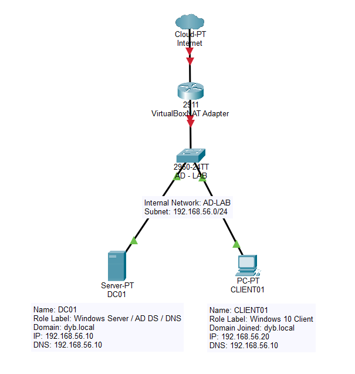

# Active Directory Lab - Windows Server
## Overview
This project documents the implementation of a basic enterprise Active Directory environment using Windows Server and a Windows Client virtual machine.
The purpose of this lab is to practice core IT Support and System Administration skills such as domain management, user administration, DNS configuration, Group Policy, shared folders and access control.
## Lab Topology

## Environment
| Component | Configuration |
|---|---|
| Hypervisor | VirtualBox / VMware / Hyper-V |
| Server OS | Windows Server Evaluation |
| Client OS | Windows 10/11 Pro |
| Domain | dyb.local |
| Domain Controller | DC01 |
| Client | CLIENT01 |
| Server IP | 192.168.56.10 |
| Client IP | 192.168.56.20 |
| DNS Server | 192.168.56.10 |

## Project Goals

- Install and configure Windows Server.
- Deploy Active Directory Domain Services.
- Create a new domain.
- Configure DNS for domain resolution.
- Create Organizational Units, users, and groups.
- Join a Windows client to the domain.
- Apply Group Policy Objects.
- Configure shared folders and NTFS permissions.
- Document troubleshooting scenarios.

## Skills Demonstrated

- Windows Server administration
- Active Directory basics
- DNS configuration
- User and group management
- Group Policy management
- File sharing and NTFS permissions
- Domain troubleshooting
- Technical documentation
