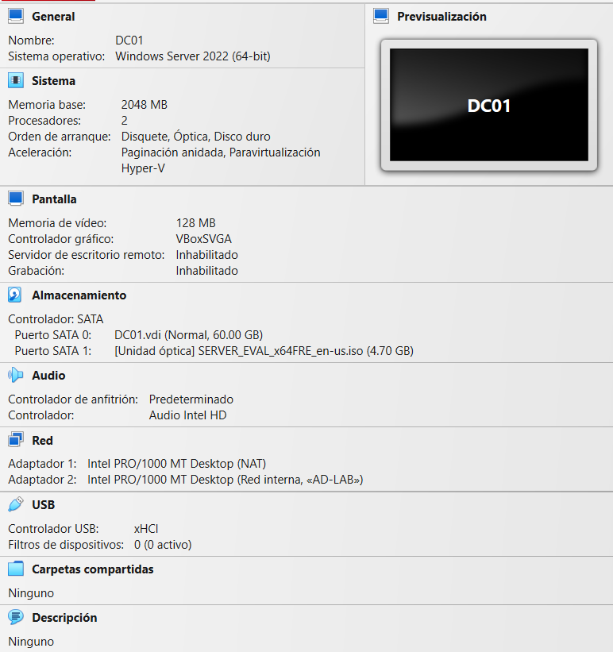
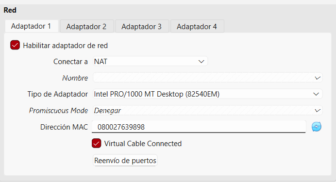
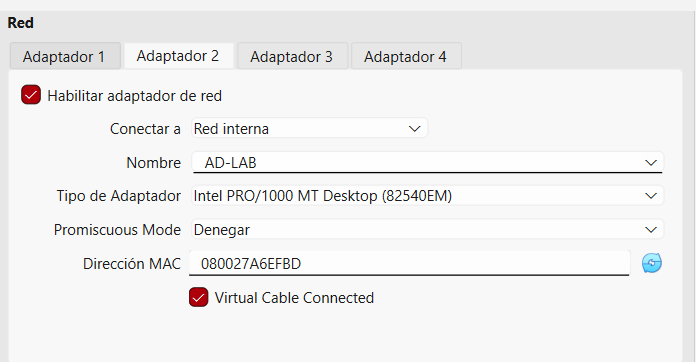
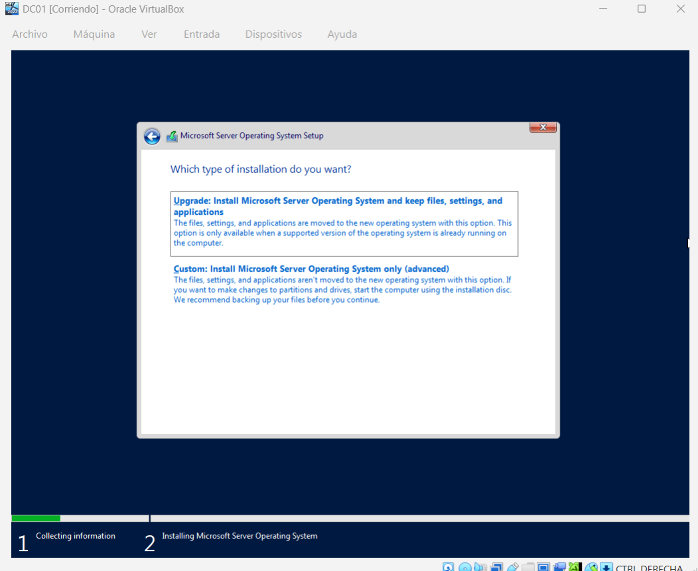

# 01 - Environment Setup

## Objective

Prepare the virtualization environment for the Active Directory lab.

## Virtual Machines

| VM Name | Operating System | CPU | RAM | Disk |
|---|---|---|---|---|
| DC01 | Windows Server Evaluation | 2 vCPU | 4 GB | 60 GB |
| CLIENT01 | Windows 10/11 Pro | 2 vCPU | 4 GB | 50 GB |

## Network Configuration

| Setting | Value |
|---|---|
| Network Type | Host-only / Internal Network |
| Server IP | 192.168.56.10 |
| Client IP | 192.168.56.20 |
| DNS Server | 192.168.56.10 |
| Domain | dyb.local |

## ISO Used

| File | Description |
|---|---|
| SERVER_EVAL_x64FRE_en-us.iso | Windows Server Evaluation ISO |

## Evidence

## Result

The virtualization environment was prepared successfully for the Windows Server installation.
## Network Adapters

| Adapter | Type | Purpose |
|---|---|---|
| Adapter 1 | NAT | Provides internet access to the Windows Server VM |
| Adapter 2 | Internal Network: AD-LAB | Isolated lab network for domain communication between server and client |

## Evidence

## Installation Type

A clean installation was selected because this virtual machine did not have an existing operating system.

