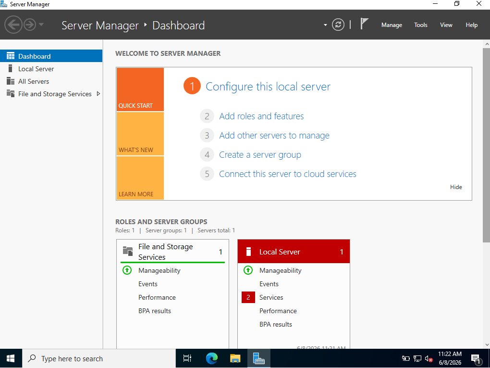
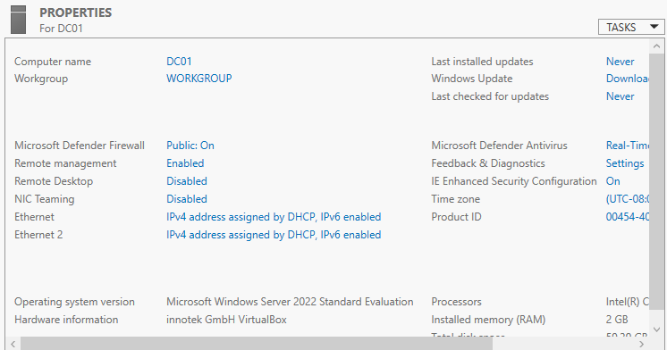
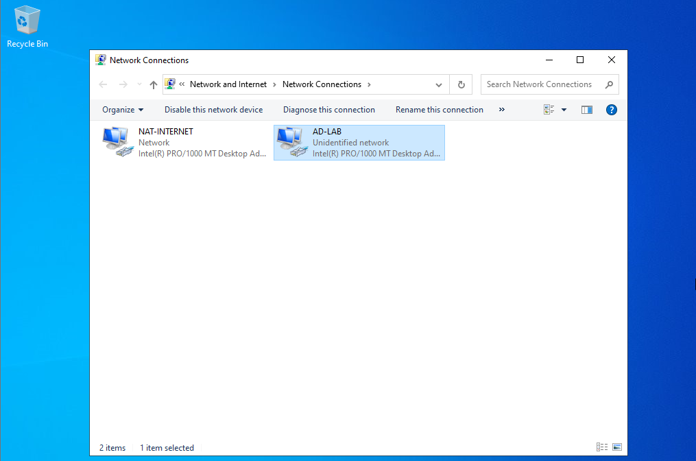
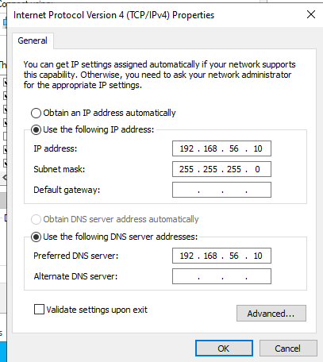

# 02 - Windows Server Installation

## Objective

Install and prepare Windows Server as the base operating system for the Active Directory lab.

## Server Configuration

| Setting | Value |
|---|---|
| Server Name | DC01 |
| Operating System | Windows Server Evaluation |
| Installation Type | Desktop Experience |
| Administrator Account | Local Administrator |
| Network Adapter 1 | NAT-INTERNET |
| Network Adapter 2 | AD-LAB |

## Static IP Configuration

| Setting | Value |
|---|---|
| Adapter | AD-LAB |
| IP Address | 192.168.56.10 |
| Subnet Mask | 255.255.255.0 |
| Default Gateway | Empty |
| Preferred DNS | 192.168.56.10 |

## Steps

1. Installed Windows Server Evaluation using the Desktop Experience option.
2. Created the local Administrator password.
3. Renamed the server to DC01.
4. Identified the NAT and internal lab network adapters.
5. Renamed the network adapters for better documentation.
6. Configured a static IP address on the AD-LAB adapter.
7. Verified the configuration using `ipconfig /all`.

## Evidence

## Result

Windows Server was installed and configured with a static IP address, preparing it for the Active Directory Domain Services role.
