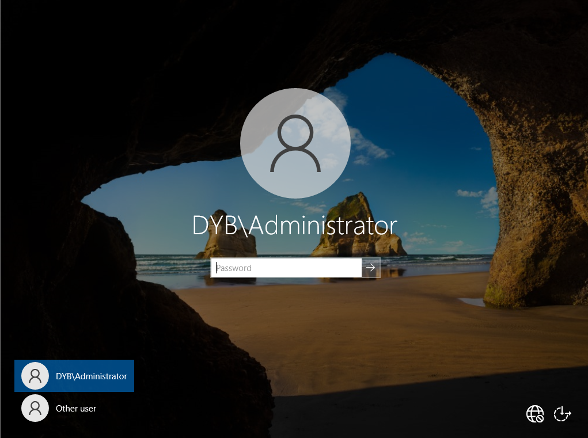

# 03 - Active Directory Domain Services

## Objective

Install Active Directory Domain Services and promote DC01 as the first Domain Controller of the lab environment.

## Domain Configuration

| Setting | Value |
|---|---|
| Server Name | DC01 |
| Role | Active Directory Domain Services |
| Forest | dyb.local |
| Domain | dyb.local |
| DNS | Installed with AD DS |
| Domain Controller | DC01 |

## Steps

1. Opened Server Manager.
2. Installed the Active Directory Domain Services role.
3. Promoted DC01 as a Domain Controller.
4. Created a new forest named dyb.local.
5. Installed DNS as part of the AD DS configuration.
6. Restarted the server after promotion.

## Evidence

## Result

DC01 was successfully promoted as the first Domain Controller for the dyb.local domain.