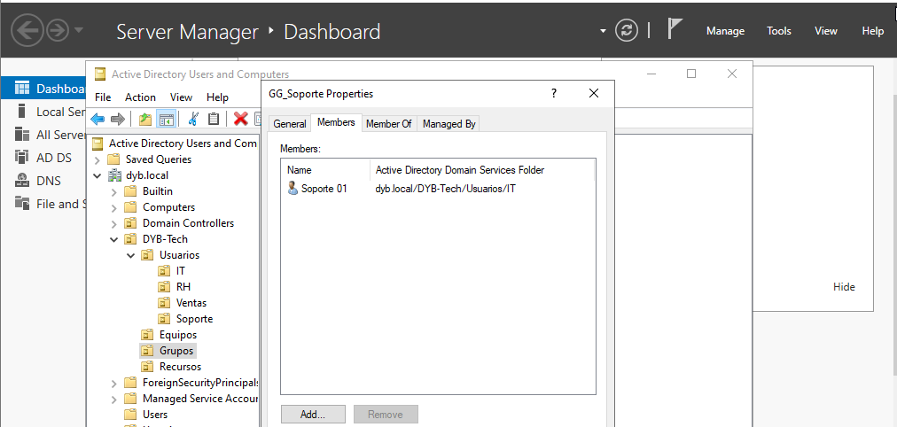
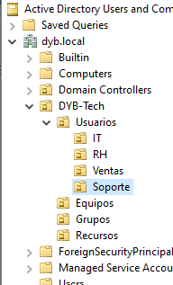
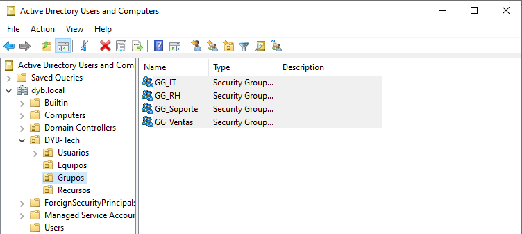

# 04 - Users, Groups and Organizational Units

## Objective

Create an enterprise-like Active Directory structure using Organizational Units, domain users, and security groups.

## Organizational Unit Structure

The following OU structure was created to organize users, computers, groups, and resources.

```text
dyb.local
└── DYB-Tech
    ├── Usuarios
    │   ├── IT
    │   ├── RH
    │   ├── Ventas
    │   └── Soporte
    ├── Equipos
    ├── Grupos
    └── Recursos
```
## Security Groups
| Group Name | Scope  | Type     | Purpose                   |
| ---------- | ------ | -------- | ------------------------- |
| GG_IT      | Global | Security | IT department access      |
| GG_RH      | Global | Security | HR department access      |
| GG_Ventas  | Global | Security | Sales department access   |
| GG_Soporte | Global | Security | Support department access |
## Domain Users
| Username  | Department | Group      |
| --------- | ---------- | ---------- |
| admin.it  | IT         | GG_IT      |
| soporte01 | Soporte    | GG_Soporte |
| rh01      | RH         | GG_RH      |
| rh02      | RH         | GG_RH      |
| ventas01  | Ventas     | GG_Ventas  |
| ventas02  | Ventas     | GG_Ventas  |

## Evidence



