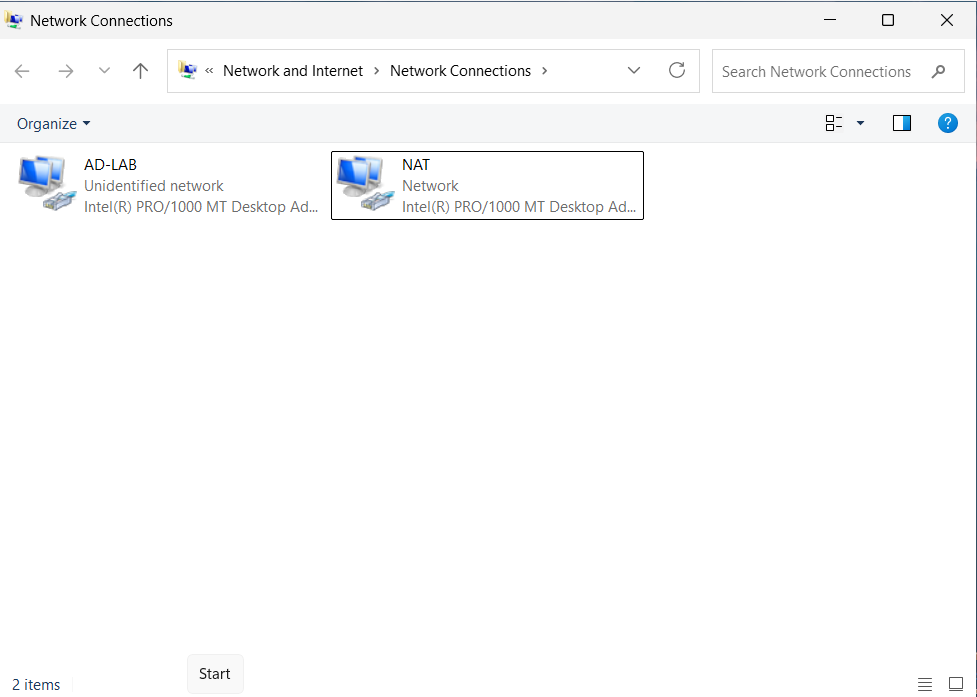
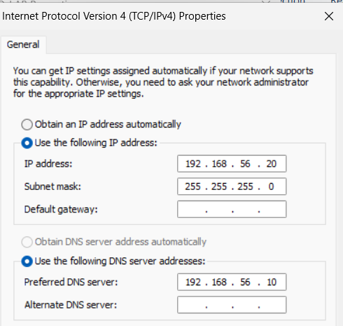
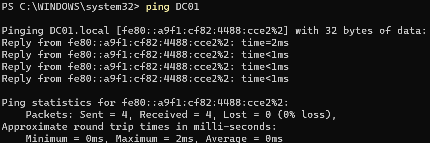
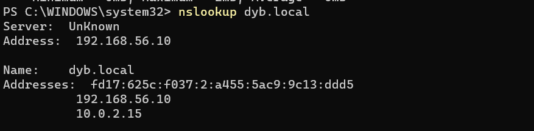
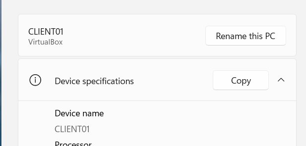
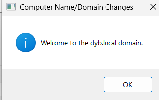
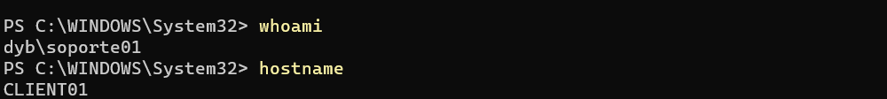
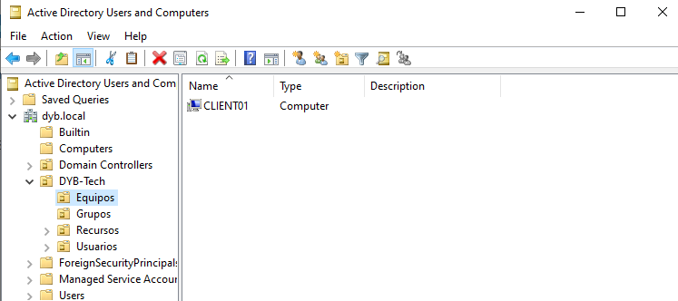

# 05 - Domain Join Client

## Objective

Join a Windows client machine to the Active Directory domain `dyb.local` and validate domain authentication using a domain user account.

This step confirms that the Domain Controller, DNS configuration, and client network settings are working correctly.

---

## Client Configuration

| Setting | Value |
|---|---|
| Client Name | CLIENT01 |
| Operating System | Windows 11 Enterprise Evaluation |
| Domain | dyb.local |
| Domain Controller | DC01 |
| Client IP Address | 192.168.56.20 |
| Subnet Mask | 255.255.255.0 |
| Preferred DNS Server | 192.168.56.10 |
| Lab Network | AD-LAB |

---

## Network Configuration

The client machine was configured with a static IP address on the AD-LAB network adapter.

The DNS server was configured to point to the Domain Controller `DC01`.

| Adapter | IP Address | DNS Server | Purpose |
|---|---|---|---|
| NAT-INTERNET | DHCP | Automatic | Internet access |
| AD-LAB | 192.168.56.20 | 192.168.56.10 | Domain communication |

### Evidence

---

## Connectivity Tests

Before joining the domain, connectivity with the Domain Controller was validated using ping and DNS lookup tests.

The client was able to reach the Domain Controller by IP address and resolve the domain name `dyb.local`.

### Evidence

---

## Domain Join Process

The client machine was joined to the Active Directory domain using the System Properties panel.

### Steps

1. Opened System Properties.
2. Changed the computer name to `CLIENT01`.
3. Selected the domain option.
4. Entered the domain name `dyb.local`.
5. Provided domain administrator credentials.
6. Joined the client machine to the domain.
7. Restarted the client machine.

### Domain Credentials Used

| Field | Value |
|---|---|
| Username | DYB\Administrator |
| Domain | dyb.local |

### Evidence

---

## Domain User Login Validation

After restarting CLIENT01, a domain user account was used to sign in.

### User Account Used

| Field | Value |
|---|---|
| Username | DYB\soporte01 |
| Department | Soporte |
| Security Group | GG_Soporte |

The login was validated by confirming that the current user belonged to the `dyb` domain and that the logon server was `DC01`.

### Expected Result

| Validation | Expected Value |
|---|---|
| Current user | dyb\soporte01 |
| Computer name | CLIENT01 |
| Logon server | \\DC01 |

### Evidence

---

## Moving CLIENT01 to the Equipos OU

After the domain join, the computer object `CLIENT01` appeared in the default `Computers` container inside Active Directory.

The computer object was moved to:

DYB-Tech → Equipos

This keeps the Active Directory structure organized and prepares the environment for future Group Policy application.

### Evidence

---

## Result

CLIENT01 was successfully joined to the `dyb.local` Active Directory domain.

The domain user `DYB\soporte01` was able to sign in successfully, confirming that domain authentication, DNS resolution, and client-to-domain communication were working correctly.