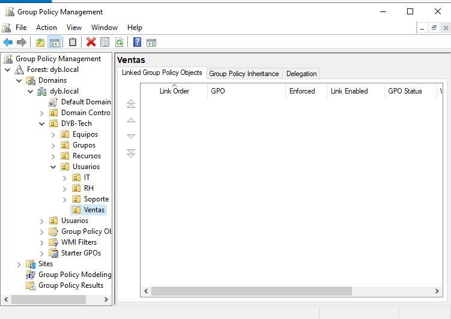
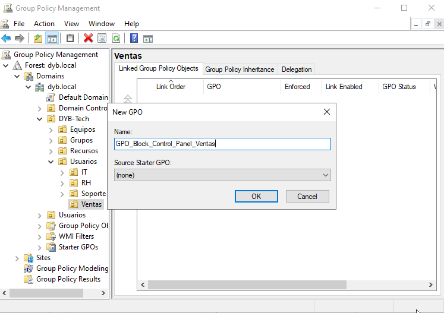
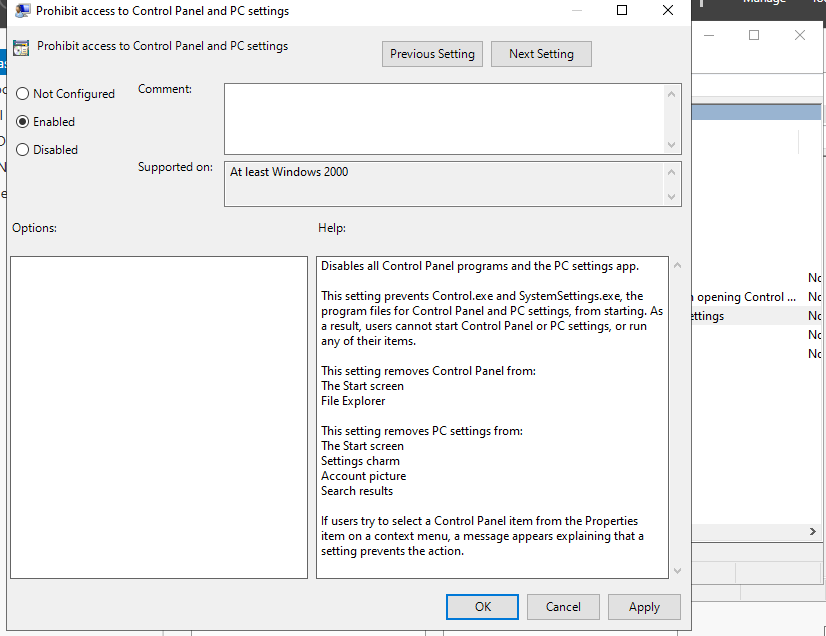
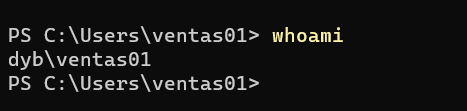
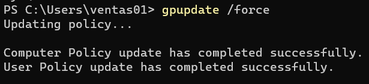
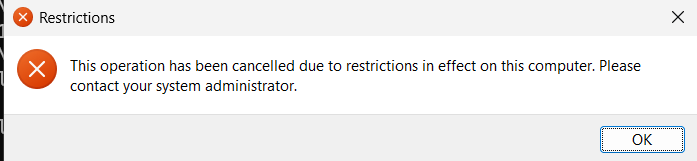
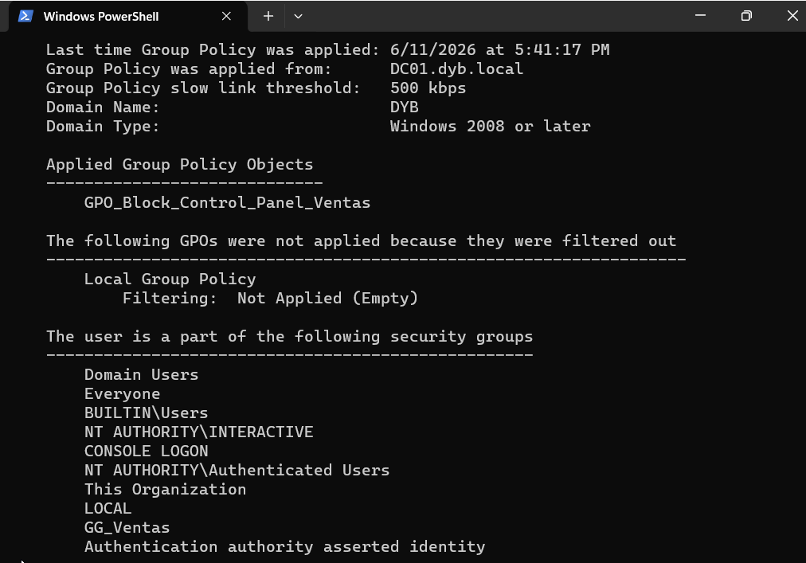

# 06 - Group Policies

## Objective

Create and apply a Group Policy Object to restrict access to Control Panel and Windows Settings for users in the Sales department.

This step demonstrates centralized policy management using Active Directory Group Policy.

---

## GPO Configuration

| Setting        | Value                                            |
| -------------- | ------------------------------------------------ |
| GPO Name       | GPO_Block_Control_Panel_Ventas                   |
| Linked OU      | DYB-Tech → Usuarios → Ventas                     |
| Policy Type    | User Configuration                               |
| Target Users   | ventas01, ventas02                               |
| Policy Setting | Prohibit access to Control Panel and PC settings |
| Status         | Enabled                                          |

---

## Group Policy Management

The Group Policy Management console was used to create and manage the GPO inside the `dyb.local` domain.

The policy was linked directly to the `Ventas` Organizational Unit so that it only affects users located inside that OU.

### Evidence

---

## Policy Configuration

The policy was configured under User Configuration because the restriction applies to users, not computers.

The following setting was enabled:

Prohibit access to Control Panel and PC settings

This prevents users in the Ventas OU from opening Control Panel and Windows Settings.

### Evidence

---

## User Validation

The policy was tested using the domain user `DYB\ventas01`.

This user belongs to the Ventas department and is located inside the Ventas OU, where the GPO was linked.

| User     | Department | Group     | Expected Policy       |
| -------- | ---------- | --------- | --------------------- |
| ventas01 | Ventas     | GG_Ventas | Control Panel blocked |

### Evidence

---

## Policy Update

After signing in as `DYB\ventas01`, the Group Policy update was forced from the client machine.

This was done to make sure the latest domain policies were applied to the user session.

### Evidence

---

## Policy Result

After the policy update, the user `DYB\ventas01` was not able to access Control Panel or Windows Settings.

This confirms that the Group Policy Object was applied successfully.

### Evidence

---

## Applied Policy Verification

The applied policies were verified from CLIENT01 using the domain user `DYB\ventas01`.

The expected result was that the GPO `GPO_Block_Control_Panel_Ventas` appeared as an applied policy for the user.

### Evidence

---

## Result

The Group Policy Object was successfully created, linked, and applied to the Ventas OU.

The domain user `DYB\ventas01` was restricted from accessing Control Panel and Windows Settings, confirming that centralized policy enforcement was working correctly through Active Directory Group Policy.
