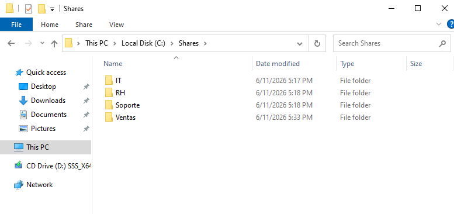
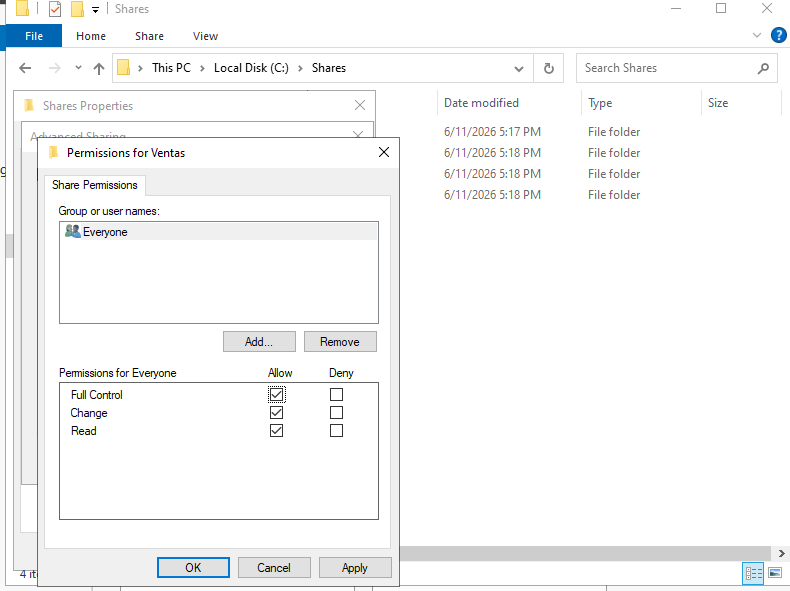
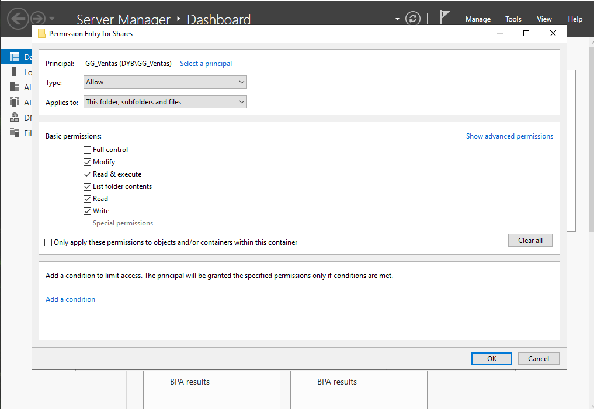
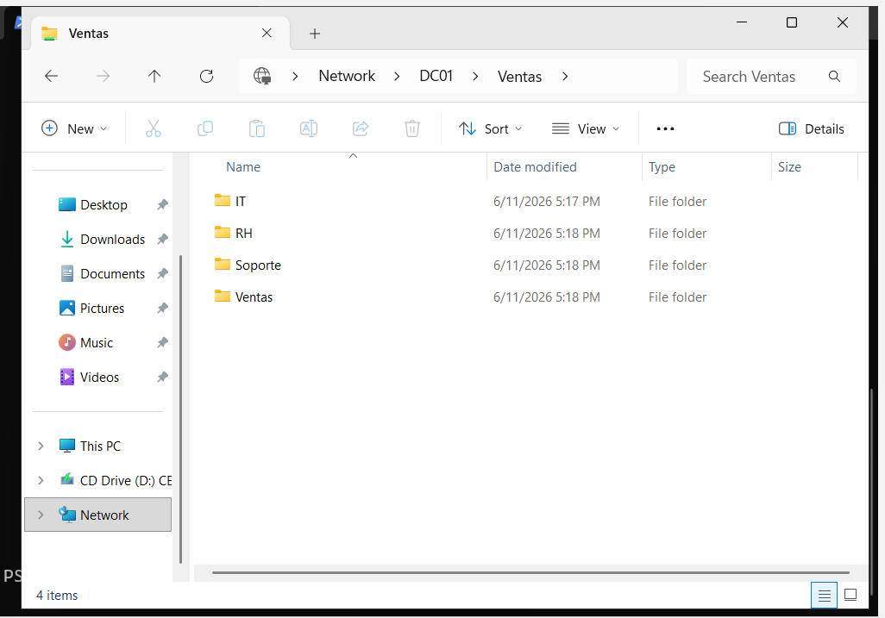
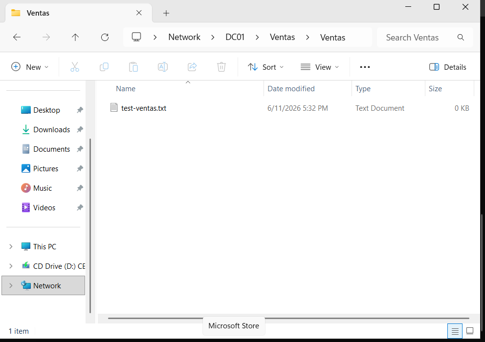
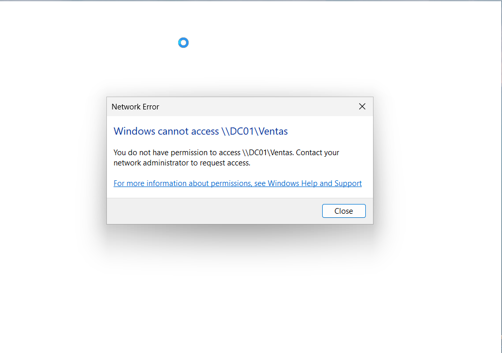

# 07 - Shared Folders and Permissions

## Objective

Create shared folders on the Domain Controller and control access using Active Directory security groups.

This step demonstrates how centralized identity management can be used to manage file access permissions in an enterprise environment.

---

## Folder Structure

The following shared folder structure was created on DC01:

C:\Shares
├── IT
├── RH
├── Ventas
└── Soporte

Each folder represents a different department in the organization.

### Evidence

---

## Access Control Design

Access to each shared folder was assigned based on Active Directory security groups.

| Shared Folder | Authorized Group | Permission Level |
| ------------- | ---------------- | ---------------- |
| IT            | GG_IT            | Modify           |
| RH            | GG_RH            | Modify           |
| Ventas        | GG_Ventas        | Modify           |
| Soporte       | GG_Soporte       | Modify           |

The purpose of this configuration is to ensure that users can only access the resources that belong to their department.

---

## Share Permissions

The department folders were shared from DC01 using Windows file sharing.

For this lab, share permissions were configured broadly, while NTFS permissions were used to enforce the real access control.

| Permission Type   | Configuration                                 |
| ----------------- | --------------------------------------------- |
| Share Permissions | Everyone allowed at share level               |
| NTFS Permissions  | Restricted by Active Directory security group |

This approach allows NTFS permissions to define the effective access for each department group.

### Evidence

---

## NTFS Permissions

NTFS permissions were configured on each department folder to restrict access based on group membership.

For the Ventas folder, the following permissions were applied:

| Principal      | Permission   |
| -------------- | ------------ |
| Administrators | Full Control |
| SYSTEM         | Full Control |
| GG_Ventas      | Modify       |

Users outside the `GG_Ventas` group should not be able to access the Ventas shared folder.

### Evidence

---

## Access Test with Authorized User

The shared folder access was tested from CLIENT01 using the domain user `DYB\ventas01`.

Since `ventas01` belongs to the `GG_Ventas` security group, the user was expected to access the Ventas shared folder successfully.

| Test            | Expected Result |
| --------------- | --------------- |
| User            | DYB\ventas01    |
| Group           | GG_Ventas       |
| Shared Folder   | \DC01\Ventas    |
| Expected Access | Allowed         |

The user was able to open the shared folder and create a test file, confirming that the Modify permission was working correctly.

### Evidence

---

## Access Test with Unauthorized User

The access restriction was tested using the domain user `DYB\rh01`.

Since `rh01` belongs to the `GG_RH` group and not to `GG_Ventas`, the user was expected to be denied access to the Ventas shared folder.

| Test            | Expected Result |
| --------------- | --------------- |
| User            | DYB\rh01        |
| Group           | GG_RH           |
| Shared Folder   | \DC01\Ventas    |
| Expected Access | Denied          |

The user was not able to access the Ventas shared folder, confirming that the NTFS permissions were correctly restricting access by group membership.

### Evidence

---

## Result

Shared folders were successfully created and configured on DC01.

Access was controlled using Active Directory security groups and NTFS permissions. The authorized user `DYB\ventas01` was able to access and modify the Ventas shared folder, while the unauthorized user `DYB\rh01` was denied access.

This confirms that department-based access control was working correctly in the Active Directory lab environment.
